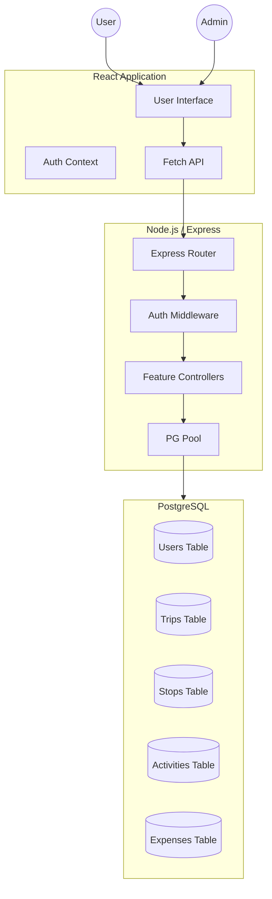

# Traveloop System Architecture & Documentation

## 1. System Architecture

## 2. Database Schema (PostgreSQL)

### Users
- `id`: UUID (PK)
- `name`: VARCHAR(100)
- `email`: VARCHAR(255) (Unique)
- `password_hash`: TEXT
- `role`: VARCHAR(10) (user, admin)
- `is_active`: BOOLEAN (Moderation)
- `phone`, `city`, `country`: Profile Details
- `created_at`: TIMESTAMP

### Trips
- `id`: UUID (PK)
- `user_id`: UUID (FK)
- `title`: VARCHAR(255)
- `start_date`, `end_date`: DATE
- `description`: TEXT
- `is_public`: BOOLEAN
- `status`: VARCHAR(20)

### Stops
- `id`: UUID (PK)
- `trip_id`: UUID (FK)
- `city_name`, `country`: VARCHAR
- `arrival_date`, `departure_date`: DATE
- `sequence_order`: INTEGER

### Activities
- `id`: UUID (PK)
- `stop_id`: UUID (FK)
- `activity_name`: VARCHAR
- `cost_estimate`: DECIMAL
- `category`: VARCHAR
- `scheduled_time`: TIME

## 3. API Endpoints

### Authentication
- `POST /api/auth/register`: Create account
- `POST /api/auth/login`: Authenticate & get JWT
- `GET /api/auth/me`: Get current user info
- `PATCH /api/auth/profile`: Update profile
- `DELETE /api/auth/account`: Delete own account

### Trips & Itinerary
- `GET /api/trips`: List user trips
- `POST /api/trips`: Create new trip
- `GET /api/trips/:id`: Get full trip details (stops + activities)
- `PATCH /api/trips/:id`: Update trip info
- `DELETE /api/trips/:id`: Remove trip
- `POST /api/trips/stop`: Add stop to trip
- `POST /api/trips/activity`: Add activity to stop
- `PATCH /api/trips/stop/:id`: Update stop (sequence/dates)

### Admin Tools
- `GET /api/admin/stats`: Platform analytics
- `GET /api/admin/users`: List all users
- `GET /api/admin/users/:userId/trips`: Drilldown into user data
- `PATCH /api/admin/users/:id/status`: Ban/Unban user
- `PATCH /api/admin/users/:id/role`: Change user role

### Community
- `GET /api/trips/public/community`: Browse public trips
- `GET /api/trips/public/top-destinations`: Recommended spots
- `POST /api/trips/public/copy/:id`: Clone public trip to own account
