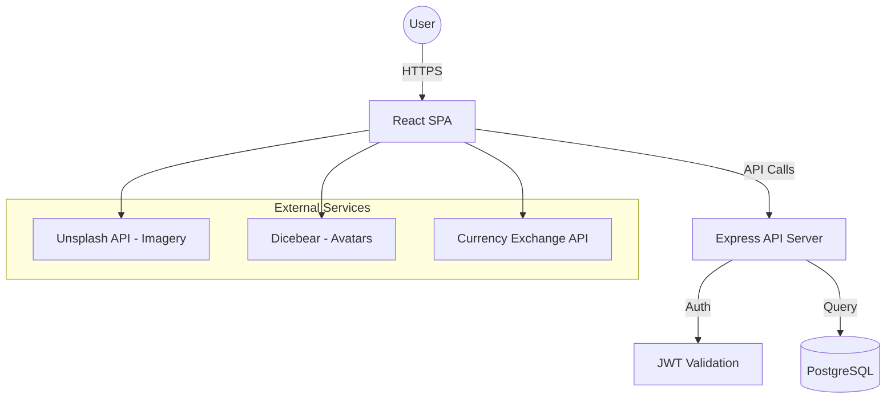

# Traveloop Architecture Documentation

## Overview

Traveloop follows a **three-layer architecture** with clear separation of concerns:
- **Frontend Layer**: React.js with Vite and vanilla CSS
- **API Layer**: Express.js REST API with modular controllers
- **Data Layer**: PostgreSQL relational database with UUID-based entities

## Technology Stack

- **Frontend**: React.js with Vite
- **Styling**: Vanilla CSS (Premium Voyage design system)
- **State Management**: React Context API
- **Backend**: Node.js with Express
- **Database**: PostgreSQL
- **Deployment**: Vercel (Frontend) + Render (Backend/DB)

## Architecture Diagram

## Core Modules

### 1. Trip Builder Engine
A stateful layer that manages the relationship between Trips, Stops, and Activities. It keeps itinerary order consistent and supports real-time cost estimates.

### 2. Financial Tracking
Combines planned activity costs and recorded expenses to provide a budget overview. The flow is designed to support invoice-style summaries.

### 3. Contextual Data Sync
React Context shares authentication state and related app-wide values across the UI without repeated prop drilling.

### 4. Admin Command Center
An access-restricted dashboard for platform oversight, including analytics, user management, and system-wide signals.

## Deployment Strategy

1. **Source Control**: GitHub
2. **Backend**: Render.com connected to PostgreSQL
3. **Frontend**: Vercel.com for SPA hosting and static assets

## Security Model

- Passwords are hashed with Bcrypt.
- JWT tokens expire after 8 hours.
- CORS is handled by the API server.
- Parameterized queries are used to reduce SQL injection risk.
