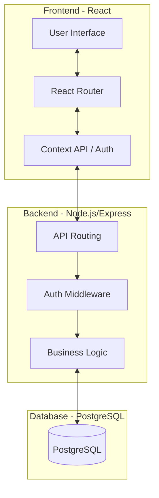

# Traveloop System Architecture

This document describes the high-level architecture and technical stack of the Traveloop platform.

## Architecture Overview

Traveloop follows a modern **Client-Server** architecture with a clear separation of concerns between the user interface and data persistence layers.

## Technology Stack

### Frontend
- **React 18**: Component-based UI library.
- **Vite**: Ultra-fast build tool and dev server.
- **Vanilla CSS**: Custom design system with CSS variables for maximum flexibility and performance.
- **Lucide Icons**: Clean, vector-based iconography.
- **React Router 6**: Client-side routing and navigation.

### Backend
- **Node.js**: JavaScript runtime.
- **Express.js**: Lightweight web framework for API development.
- **JWT (JSON Web Tokens)**: Secure, stateless authentication.
- **Bcrypt**: Industrial-strength password hashing.
- **PG (Node-Postgres)**: Non-blocking PostgreSQL client.

### Infrastructure
- **Vercel**: High-performance hosting for the React frontend.
- **Render**: Managed hosting for the Node.js API and PostgreSQL database.

## Data Flow
1. **User Action**: User interacts with the UI (e.g., clicks "Add Activity").
2. **API Call**: Frontend sends an authenticated HTTP request (JWT in header) to the Backend.
3. **Validation**: Backend middleware verifies the JWT and ensures the user has access.
4. **Execution**: The Controller executes the requested logic and interacts with the PostgreSQL DB.
5. **Response**: Backend returns a JSON response to the Frontend.
6. **UI Update**: Frontend updates local state and provides feedback via Toast notifications.
