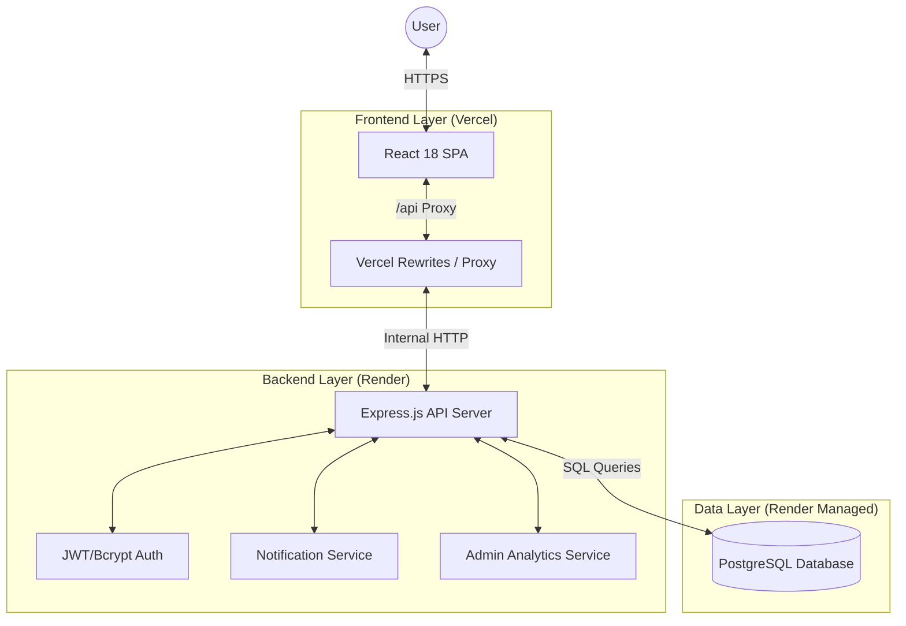

# Traveloop System Architecture

This document describes the high-level architecture, technology stack, and design patterns used in the Traveloop platform.

## System Architecture Diagram

## Technology Stack

### Frontend (Client)
- **Framework**: React 18 (Vite-powered)
- **State Management**: React Context API (`AuthContext`, `CurrencyContext`)
- **Routing**: React Router v6 (SPA)
- **Styling**: Vanilla CSS with the "Premium Voyage" design system
- **Charts**: Chart.js for Admin and Budget analytics

### Backend (Server)
- **Runtime**: Node.js
- **Framework**: Express.js
- **Database**: PostgreSQL (Relational)
- **Authentication**: JWT (JSON Web Tokens) with `bcryptjs` (Cost factor 12)
- **Environment**: Dotenv for secure configuration

## Design Patterns

### 1. Middleware Chain (Backend)
The backend uses a chain of responsibility pattern for authentication and authorization:
- `verifyToken`: Decodes JWT and attaches the user payload to `req.user`.
- `verifyAdmin`: Checks the `role` field in the payload to restrict access to management routes.

### 2. Single Source of Truth (Database)
The platform follows a strict relational model. Analytics (e.g., top destinations, user growth) are calculated using live SQL aggregations rather than redundant fields, ensuring data consistency.

### 3. SPA Pattern (Frontend)
The application is a Single Page Application. To support direct links and page refreshes on hosting providers like Vercel/Netlify, a rewrite rule is implemented:
- `vercel.json` redirects all non-file requests to `index.html`.

## Deployment Flow

### Local Development
1. `npm run dev` in `server` (Port 5000)
2. `npm run dev` in `client` (Port 5173 - Proxied to 5000)

### Production
- **Database**: Render PostgreSQL (Managed)
- **Backend**: Render Web Service (linked to `main` branch)
- **Frontend**: Vercel (rewrites `/api` to the Render backend)

## Security Model
- All passwords are encrypted with **Bcrypt (cost factor 12)**.
- JWT tokens expire in **8 hours** and are required for all non-public routes.
- **CORS** is restricted to the specific frontend origin in production.
- **SQL Injection** protection via `pg` parameterized queries.
