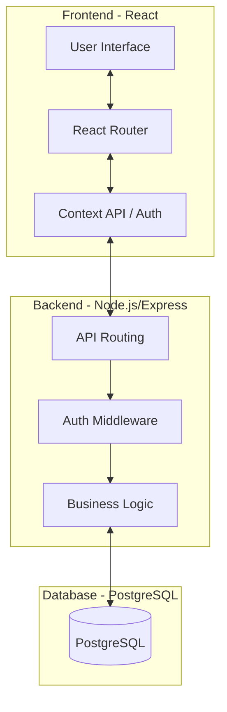

# Traveloop Architecture Documentation

## Overview

Traveloop is a modern, full-stack travel planning platform built with a decoupled architecture for scalability and performance.

## Technology Stack
- **Frontend**: React.js with Vite
- **Styling**: Vanilla CSS (Custom Design System)
- **State Management**: React Context API
- **Backend**: Node.js with Express
- **Database**: PostgreSQL
- **Deployment**: Vercel (Frontend) + Render (Backend)

## Architecture Diagram

## Core Modules

### 1. Trip Builder Engine
A complex state machine that manages the hierarchical relationship between Trips, Stops, and Activities. It ensures chronological consistency and manages cost estimations in real-time.

### 2. Financial Tracking
Consolidates planned activity costs and actual recorded expenses to provide a comprehensive budget health overview. It features an automated invoice generation system for trip settlement.

### 3. Contextual Data Sync
Uses React Context to share authentication state and live currency conversion rates across all components, ensuring a consistent user experience without redundant API calls.

### 4. Admin Command Center
A restricted dashboard for platform oversight, featuring real-time usage analytics, user management, and system-wide notification broadcasting.

## Deployment Strategy
The application follows a standard CI/CD pipeline:
1. **Source Control**: GitHub (Branch: `Second`)
2. **Backend**: Render.com (Connected to Managed PostgreSQL)
3. **Frontend**: Vercel.com (Handles SPA routing and Static Assets)
