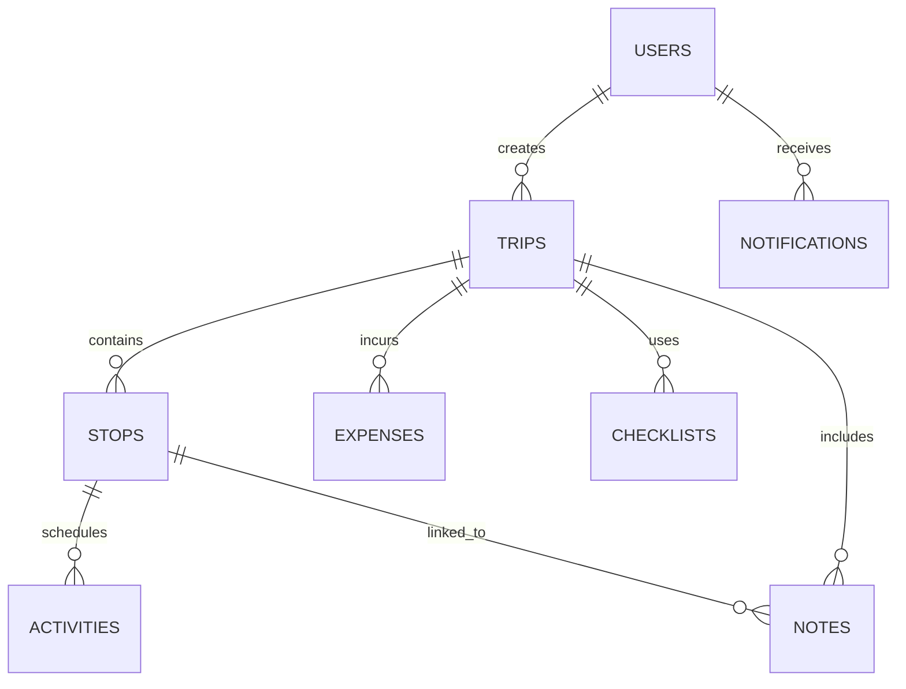

# Traveloop Database Specification

This document details the PostgreSQL schema and relationship model for the Traveloop platform. All tables are normalized and utilize UUIDs as primary keys for global uniqueness.

## Entity Relationship Model

## Tables

### 1. `users`
Core user identity and profile information.
| Column | Type | Constraints | Description |
| :--- | :--- | :--- | :--- |
| `id` | UUID | PK, DEFAULT uuid_generate_v4() | Primary identifier |
| `name` | VARCHAR(100) | NOT NULL | Display name |
| `email` | VARCHAR(255) | UNIQUE, NOT NULL | Login credential |
| `password_hash`| VARCHAR(255) | NOT NULL | Bcrypt hashed password |
| `role` | VARCHAR(20) | CHECK (role IN ('user','admin')) | Access level |
| `profile_image_url` | TEXT | | Dicebear/URL avatar |
| `created_at` | TIMESTAMP | DEFAULT NOW() | Registration date |

### 2. `trips`
High-level travel itineraries.
| Column | Type | Constraints | Description |
| :--- | :--- | :--- | :--- |
| `id` | UUID | PK | |
| `user_id` | UUID | FK (users.id), CASCADE | Owner of the trip |
| `title` | VARCHAR(255) | NOT NULL | Trip name |
| `start_date` | DATE | NOT NULL | |
| `end_date` | DATE | NOT NULL | |
| `description` | TEXT | | |
| `is_public` | BOOLEAN | DEFAULT FALSE | Community feed visibility |
| `status` | VARCHAR(50) | | Planned, Ongoing, Completed |

### 3. `stops`
City-level destinations within a trip.
| Column | Type | Constraints | Description |
| :--- | :--- | :--- | :--- |
| `id` | UUID | PK | |
| `trip_id` | UUID | FK (trips.id), CASCADE | Parent trip |
| `city_name` | VARCHAR(255) | NOT NULL | |
| `country` | VARCHAR(100) | NOT NULL | |
| `arrival_date` | DATE | | |
| `departure_date`| DATE | | |
| `sequence_order`| INT | DEFAULT 1 | Sort order in builder |

### 4. `activities`
Granular events scheduled within a stop.
| Column | Type | Constraints | Description |
| :--- | :--- | :--- | :--- |
| `id` | UUID | PK | |
| `stop_id` | UUID | FK (stops.id), CASCADE | Parent stop |
| `activity_name` | VARCHAR(255) | NOT NULL | |
| `cost_estimate` | NUMERIC(10,2) | DEFAULT 0 | |
| `category` | VARCHAR(50) | | Sightseeing, Dining, etc. |
| `scheduled_time`| TIME | | |

### 5. `notifications`
User-specific alerts and platform logs.
| Column | Type | Constraints | Description |
| :--- | :--- | :--- | :--- |
| `id` | UUID | PK | |
| `user_id` | UUID | FK (users.id), CASCADE | Recipient |
| `title` | VARCHAR(255) | NOT NULL | |
| `message` | TEXT | NOT NULL | |
| `type` | VARCHAR(50) | | trip, community, system |
| `is_read` | BOOLEAN | DEFAULT FALSE | |

## Performance & Optimization
*   **Indexes**: B-Tree indexes are implemented on all Foreign Keys (`user_id`, `trip_id`, `stop_id`) and high-frequency search columns (`email`, `is_public`).
*   **Integrity**: `ON DELETE CASCADE` is enforced throughout to prevent orphaned records in child tables (stops, activities, etc.) when a parent trip or user is deleted.
